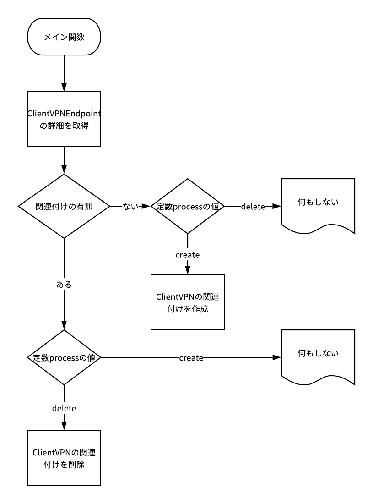

# ClientVPNAutoAssociate

ClientVPN自動関連付け管理スクリプト

CloudWatchEventをトリガーに自動でClientVPNの関連付けを付け外しします。

## 概要

特定のClientVPNEndpointに関連付けの有無を調べ、実行引数によって作成するか削除するかを切り替えて実行される。

図




## 使い方

1. IAMポリシーの作成

    ClientVPNの操作権限を持つIAMポリシーを作成します。

    例

    |ポリシー名|内容|
    |---|---|
    |ClientVPNFullAccess|ClientVPNFullAccess.json|

2. IAMロールの作成

    Lambda用のロールを作成します。

    例

    |ロール名|アタッチポリシー|
    |---|---|
    |ClientVPNAutoAssociateForLambda|ClientVPNFullAccess|
    ||AWSLambdaBasicExecutionRole|


3. Lambda関数の作成

    Lambda関数を作成します。

    例

    |関数名|ランタイム|アクセス権限|
    |---|---|---|
    |ClientVPNAutoAssociate|Python 3.7|ClientVPNAutoAssociateForLambda|

4. レイヤーの作成

    Lambdaで使用されるPython用SDKがClientVPNのAPI呼び出しに適したバージョンでないため、レイヤーを作成します。

    例

    |レイヤーの名前|説明|zipファイル|互換性のあるランタイム|
    |---|---|---|---|
    |python-boto3|boto3-1.9.172 && botocore-1.12.172 pt2.py3-none-any|boto3-1.9.172.zip|python2.7 python3.6 python3.7|

5. 関数の設定の編集

    関数の設定を編集します。

    1. レイヤーの追加

        例

        |レイヤー名|バージョン|
        |---|---|
        |python-boto3|1|


    2. 関数コードの修正

        lambda_function.py

    3. 環境変数の設定

        この関数には環境変数が必須です。
        環境変数が設定されていない場合、予期せぬエラーとなることがあります。

        |環境変数キー|値|
        |---|---|
        |CLIENT_VPNENDPOINT_ID|｛管理したいClientVPNEndpointのID｝|
        |SUBNET_ID|｛関連付けを管理したいVPCサブネットのID｝|
        |DEBUG|｛True or False｝|

        > DEBUGをTrueに設定すると、コード実行の詳細ログが出力されます。

    4. 基本設定の編集

        例

        |タイムアウト|
        |---|
        |5分00秒|

    5. 関数の実行テスト

        この関数はLambda実行時のイベント定数を引数とすることを前提として作られています。
        json形式で作成次の内容で作成することが必須です。

        例

        ```
        {
            "process": "create"
        }
        ```

        キーは`process`を指定します。

        ```
        {
            "process": "delete"
        }
        ```
        値は、`create`または`delete`で指定します。