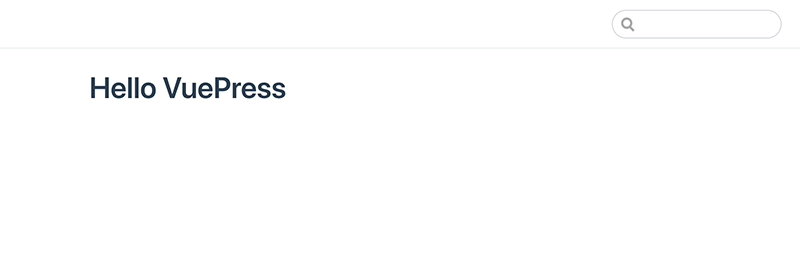

# VuePressでブログをはじめる

技術的なドキュメントを残すのに適した方法はいくつかあるでしょう。

例えば、

* [はてなブログ](https://hatenablog.com/)
* [Qiita](https://qiita.com/)
* 静的ジェネレータ（[HUGO](https://gohugo.io/),[MkDocs](https://www.mkdocs.org/),[Gatsby](https://www.gatsbyjs.org/),etc..）

などなど。手段はいろいろとありますが、[VuePress](https://vuepress.vuejs.org/)を用いて記録を残すこととしました。


## VuePressとは

>「VuePress」とは、Vue.jsの作者であるEvan You氏が作成した静的サイトジェネレータです。
>わかりやすい特徴としては、Markdownで書かれたファイルをhtmlとして生成することができ、さらにMarkdown内でVueが使用可能になっていたり、Vueを使ったカスタムテーマ開発ができます。
>また、デフォルトで用意されたテーマは技術文書を書くために最適化されたものになっているので、ちょっとしたドキュメント作成が容易に行えます。
>
>[VuePress入門](https://www.nxworld.net/services-resource/hello-vuepress.html)

とのこと。導入方法に沿ってひとまずやってみる。

### Getting Started

#### 導入

まずは作業用のディレクトリを作成します。

    $ mkdir <ディレクトリ名>

作成できたら、カレントディレクトリを移動します。

    $ cd <ディレクトリ名>

vuepressのインストールには、`npm`または`yarn`を使うそうです。

npmを用いてvuepressをインストールします。

バージョン確認

    $ npm -v
    6.9.0

`package.json`の作成（任意）

    # create package.json
    $ npm init -y

ローカルにVuePressをインストールします。

    $ npm i -D vuepress

バージョンを確認してみます。

    $ vuepress --version
    vuepress/1.0.1 darwin-x64 node-v12.4.0

試しにトップページのMarkdownファイルを作成してみます。

`src`という名のディレクトリを作成し、その中に`index.md`を作成してみます。

    $ mkdir src
    $ echo '# Hello VuePress' > src/index.md

VuePressをローカルインストールしたので、コマンドを実行するために`package.json`の`scripts`部分に追記します。


    {
        "scripts": {
            "dev": "vuepress dev src",
            "build": "vuepress build src"
        }
    }

#### 表示確認

試しに表示確認をしてみます。

次のコマンドを実行すると、`http://localhost:8080/`にアクセスすれば表示を確認できるようになります。

    $ npm run dev

[http://localhost:8080/](http://localhost:8080/)へアクセスしてみます。



上の画像のように表示されました。

#### ビルド

ビルドコマンドは次を実行します。

    $ npm run build
    success Generated static files in src/.vuepress/dist.

`success Generated static files in src/.vuepress/dist.`と表示され、`src/.vuepress/dist`配下に`index.html`やらが生成されているのが確認できました。

### デフォルトのMarkdown拡張やスタイル

#### ヘッダーアンカーと目次生成

> 様々な用途で使うのであればカスタムして利用することが多くなるとは思いますが、ドキュメントサポート向けに作られたこともあって、デフォルトでも下記のように便利なMarkdown拡張やそれっぽい見た目にしてくれるスタイルがひと通り用意されています。

とのこと。

> 見出し（# 〜 ######）を記述すると自動的にアンカーリンクを設定してくれます。
> また、表示させたい箇所に`[[toc]]`と記述することで、デフォルトだとページ内の##と###から生成した目次を簡単に追加することができます。

目次が簡単に作成できるのはいいですね。

#### GitHubスタイルのテーブル

> |, |, :を組み合わせればテーブル（表）を作成できます。
> 見た目はゼブラストライプを採用しているGitHubスタイルのものになります。

    | left col     | center col   | right col    |
    | ------------ |:------------:| ------------:|
    | foo          | bar          | baz          |
    | qux          | quux         | corge        |
    | grault       | garply       | waldo        |

| left col | center col | right col |
| -------- | :--------: | --------: |
| foo      |    bar     |       baz |
| qux      |    quux    |     corge |
| grault   |   garply   |     waldo |

ちゃんと中央寄せ、右寄せができてますね。

#### シンタックスハイライト

> コードの前後に\```を記述することでコードブロックとして表示させることができ、さらに最初の```記述後に言語を指定することでより見やすい形で表示してくれます。
> また、言語指定後に{行数}を記述することで特定の行をハイライトさせることも可能で、例えば下記は言語がJavaScriptで4行目をハイライト表示させたい場合になります。

    ``` js{4}
        export default {
            data () {
                return {
                    msg: 'Highlighted!'
                }
            }
        }
    ```

``` js{4}
export default {
  data () {
    return {
      msg: 'Highlighted!'
    }
  }
}
```

おぉ。

> ハイライト表示を複数行指定したい場合は、例えば2行目と4行目のように離れているならば,区切りで{2,4}と指定し、2〜4行目までのようにまとめて指定するなら-を用いて{2-4}と記述します。

とのこと。

#### カスタムコンテナ

> ちょっとしたヒントや警告を表示させたいとき用のスタイルとしてカスタムコンテナというものが用意されており、任意の文章を:::で括り、最初の:::記述後に「tip」「warning」「danger」のいずれかを記述することで表示を変えることができます。
> また、デフォルトではタイトルとして「TIP」または「WARNING」が表示されますが、下記サンプルの一番下のようにタイプ指定後に文字列を記述することで任意のタイトルで表示できます。

    ::: tip
    This is a tip
    :::
    
    ::: warning
    This is a warning
    :::
    
    ::: danger
    This is a dangerous warning
    :::
    
    ::: tip VuePress
    Vue-powered Static Site Generator
    :::

::: tip
This is a tip
:::

::: warning
This is a warning
:::

::: danger
This is a dangerous warning
:::

::: tip VuePress
Vue-powered Static Site Generator
:::

> ここで紹介しているのも用意されている中の一部で、他にもmarkdown-itで対応している絵文字が使えたり、リンク指定も内部・外部ともにできます。
> このようにちょっとしたドキュメントを作る際に使えそうな機能や見た目がデフォルトで用意されているので、簡易的なドキュメントであれば環境を用意してMarkdownを少し書くだけで簡単に作成できると思います。

とのこと。[Markdown Extensions | VuePress](https://v0.vuepress.vuejs.org/guide/markdown.html)


入門に沿ってだいたいイメージは理解できた。GitBook,Mkdocsよりかはカスタマイズしやすい印象。

[VuePress：Markdownを設定変更やプラグイン追加によってカスタマイズする方法](https://www.nxworld.net/tips/vuepress-markdown-customize.html)

## 本題：ブログ用にカスタマイズする

ようやく本題。

デフォルトのVuePressのテーマが見やすかったので[VuePress 1.xでブログを作ってみる](https://qiita.com/youdie/items/88df59a3ebaf47e3d992) に習ってやってみたのだけれども、Vue.jsについて大した知識がないので、うまくいかなかった。

開発が盛んということで、プラグインの変更も多々あって修正が増えたら面倒だなと思ったので、とりあえずはてっとり早く開設するために、綺麗なテーマを使うことにした。

[vuepress-theme-meteorlxy](https://vuepress-theme-meteorlxy.meteorlxy.cn/posts/2019/02/27/theme-guide-en.html)

[VuePressにテーマを適用させる](https://taku-ando.github.io/posts/vuepress/20180709_vuepress_theme.html)


### テーマのインストール

1. 適当なフォルダを作る

2. vuepressをインストールする。

3. vuepress-theme-meteorlxyをインストールする。

   ```
   $ npm install -D vuepress-theme-meteorlxy
   ```

   `node_modules/vuepress-theme-meteorlxy`にインストールされた。


### カスタマイズ


> Create `src/_posts` directory and the config file of Vuepress. The structure of your project looks like:

`src/_posts`配下に記事用のMarkdownファイルを置いてねとのこと。

> Notice that `src/index.md` or `src/README.md` is not necessray. This theme will auto add homepage for you.

お？index.mdとか無くても動くって？

`.vuepress/config.js`をひとまずまるっとコピペして実行したら、できました〜。

```json
module.exports = {
  // Title of your website
  title: 'My Blog',

  // Description of your website
  description: 'This is my blog',

  // Language of your website
  locales: {
    '/': {
      lang: 'en-US',
    },
  },

  // Theme to use
  theme: 'meteorlxy',

  // Theme config
  themeConfig: {
    // Language of this theme. See the [Theme Language] section below.
    lang: 'en-US',

    // Personal infomation (delete the fields if you don't have / don't want to display)
    personalInfo: {
      // Nickname
      nickname: 'meteorlxy',

      // Introduction of yourself
      description: 'Happy Coding<br/>Happy Life',

      // Email
      email: 'meteor.lxy@foxmail.com',

      // Your location
      location: 'Xi\'an City, China',

      // Your organization
      organization: 'Xi\'an Jiao Tong University',

      // Your avatar image
      // Set to external link
      avatar: 'https://www.meteorlxy.cn/assets/img/avatar.jpg',
      // Or put into `.vuepress/public` directory. E.g. `.vuepress/public/img/avatar.jpg`
      // avatar: '/img/avatar.jpg',

      // Accounts of SNS
      sns: {
        // Github account and link
        github: {
          account: 'meteorlxy',
          link: 'https://github.com/meteorlxy',
        },

        // Facebook account and link
        facebook: {
          account: 'meteorlxy.cn',
          link: 'https://www.facebook.com/meteorlxy.cn',
        },

        // LinkedIn account and link
        linkedin: {
          account: 'meteorlxy',
          link: 'http://www.linkedin.com/in/meteorlxy',
        },

        // Twitter account and link
        twitter: {
          account: 'meteorlxy_cn',
          link: 'https://twitter.com/meteorlxy_cn',
        },

        // Sina Weibo account and link
        weibo: {
          account: '@焦炭君_Meteor',
          link: 'https://weibo.com/u/2039655434',
        },

        // Zhihu account and link
        zhihu: {
          account: 'meteorlxy.cn',
          link: 'https://www.zhihu.com/people/meteorlxy.cn',
        },

        // Douban account and link
        douban: {
          account: '159342708',
          link: 'https://www.douban.com/people/159342708',
        },

        // Reddit account and link
        reddit: {
          account: 'meteorlxy',
          link: 'https://www.reddit.com/user/meteorlxy',
        },

        // Medium account and link
        medium: {
          account: 'meteorlxy.cn',
          link: 'https://medium.com/@meteorlxy.cn',
        },

        // Instagram account and link
        instagram: {
          account: 'meteorlxy.cn',
          link: 'https://www.instagram.com/meteorlxy.cn',
        },

        // GitLab account and link
        gitlab: {
          account: 'meteorlxy',
          link: 'https://gitlab.com/meteorlxy',
        },

        // Bitbucket account and link
        bitbucket: {
          account: 'meteorlxy',
          link: 'https://bitbucket.org/meteorlxy',
        },

        // Docker Hub account and link
        docker: {
          account: 'meteorlxy',
          link: 'https://hub.docker.com/u/meteorlxy',
        },
      },
    },

    // Header Config
    header: {
      // The background of the header. You can choose to use an image, or to use random pattern (geopattern)
      background: {
        // URL of the background image. If you set the URL, the random pattern will not be generated, and the `useGeo` will be ignored.
        url: '/assets/img/bg.jpg',

        // Use random pattern. If you set it to `false`, and you don't set the image URL, the background will be blank.
        useGeo: true,
      },

      // show title in the header or not
      showTitle: true,
    },

    // Show the last updated time of your posts
    lastUpdated: true,

    // The content of your navbar links
    nav: [
      { text: 'Home', link: '/', exact: true },
      { text: 'Posts', link: '/posts/', exact: false },
    ],

    // Comments config. See the [Posts Comments] section below.
    comments: {
      owner: 'meteorlxy',
      repo: 'vuepress-theme-meteorlxy',
      clientId: 'MY_CLIENT_ID',
      clientSecret: 'MY_CLIENT_SECRET',
    },

    // Pagination config
    pagination: {
      perPage: 5,
    },

    // Default Pages (Optional, the default value of all pages is `true`)
    defaultPages: {
      // Allow theme to add Home page (url: /)
      home: true,
      // Allow theme to add Posts page (url: /posts/)
      posts: true,
    },
  },
}
```

### 日本語化

config.jsをいじって日本語対応させていく。

```js
nav: [
      { text: 'ホーム', link: '/', exact: true },
      { text: '記事一覧', link: '/posts/', exact: false },
    ]
```

```js
locales: {
    '/': {
      lang: 'ja-JP',
    },
}
```

```js
themeConfig: {
    // Language of this theme. See the [Theme Language] section below.
    lang: {
      home: 'ホーム',
      posts: '記事一覧',
      category: 'カテゴリー',
      categories: 'カテゴリー一覧',
      allCategories: 'すべて',
      tag: 'タグ',
      tags: 'タグ一覧',
      createdAt: '作成日',
      updatedAt: '更新日',
      prevPost: '前の記事',
      nextPost: '次の記事',
    },
```

### 個人情報の変更

```js
  // Personal infomation (delete the fields if you don't have / don't want to display)
    personalInfo: {
      // Nickname
      nickname: 'kapioz',

      // Introduction of yourself
      description: 'Engineering Blog',

      // Your location
      location: 'Saitama,Tokyo',

      // Your organization
      organization: 'Japanese Engineer',

      // Your avatar image
      // Set to external link
      avatar: '/img/avatar.jpg',
      // Or put into `.vuepress/public` directory. E.g. `.vuepress/public/img/avatar.jpg`
      // avatar: '/img/avatar.jpg',

      // Accounts of SNS
      sns: {
        // Github account and link
        github: {
          account: 'kapioz',
          link: 'https://github.com/kapioz',
        },
        // Twitter account and link
        twitter: {
          account: '@kapioz2',
          link: 'https://twitter.com/kapioz2',
        },
        // Bitbucket account and link
        bitbucket: {
          account: 'kapioz',
          link: 'https://bitbucket.org/kapioz',
        },

      },
    },
```

### config.js変更後まとめ

```js
module.exports = {
  // Title of your website
  title: "kapiozblog",

  // Description of your website
  description: 'This is my Engineering blog',

  head: [
    ['link', { rel: 'icon', type: 'image/png', href: '/img/favicon.png' }],
    ['meta', { name: 'og:url', content: 'https://example.com/' }],
    ['meta', { name: 'og:type', content: 'website' }],
    ['meta', { name: 'og:title', content: 'kapiozblog' }],
    ['meta', { name: 'og:description', content: 'This is my Engineering blog' }],
    ['meta', { name: 'og:image', content: '/img/favicon.png' }]
  ],

  // Language of your website
  locales: {
    '/': {
      lang: 'ja',
    },
  },

  // Theme to use
  theme: 'meteorlxy',

  // Theme config
  themeConfig: {

    // Language of this theme. See the [Theme Language] section below.
    lang: {
      home: 'ホーム',
      posts: '記事一覧',
      category: 'カテゴリ',
      categories: 'カテゴリ一覧',
      allCategories: 'すべて',
      tag: 'タグ',
      tags: 'タグ一覧',
      createdAt: '作成日',
      updatedAt: '更新日',
      prevPost: '前の記事',
      nextPost: '次の記事',
      toc: '目次',
      searchHint: 'タイトルから検索',
      noRelatedPosts: '関連する投稿はありません',
    },

    // Personal infomation (delete the fields if you don't have / don't want to display)
    personalInfo: {
      // Nickname
      nickname: 'kapioz',

      // Introduction of yourself
      description: 'Engineering blog',

      // Your location
      location: 'Saitama,Tokyo',

      // Your organization
      organization: 'https://qiita.com/kapioz',

      // Your avatar image
      // Set to external link
      avatar: '/img/avatar.jpg',
      // Or put into `.vuepress/public` directory. E.g. `.vuepress/public/img/avatar.jpg`
      // avatar: '/img/avatar.jpg',

      // Accounts of SNS
      sns: {
        // Github account and link
        github: {
          account: 'kapioz',
          link: 'https://github.com/kapioz',
        },
        // Twitter account and link
        twitter: {
          account: '@kapioz2',
          link: 'https://twitter.com/kapioz2',
        },
        // Bitbucket account and link
        bitbucket: {
          account: 'kapioz',
          link: 'https://bitbucket.org/kapioz',
        },

      },
    },

    // Header Config
    header: {
      // The background of the header. You can choose to use an image, or to use random pattern (geopattern)
      background: {
        // URL of the background image. If you set the URL, the random pattern will not be generated, and the `useGeo` will be ignored.
        url: '/img/bg.jpg',

        // Use random pattern. If you set it to `false`, and you don't set the image URL, the background will be blank.
        useGeo: true,
      },

      // show title in the header or not
      showTitle: true,
    },

    // Show the last updated time of your posts
    lastUpdated: true,

    // The content of your navbar links
    nav: [
      { text: 'ホーム', link: '/', exact: true },
      { text: '記事一覧', link: '/posts/', exact: false },
    ],

    // Comments config. See the [Posts Comments] section below.
    comments: false,

    // Pagination config
    pagination: {
      perPage: 5,
    },

    // Default Pages (Optional, the default value of all pages is `true`)
    defaultPages: {
      // Allow theme to add Home page (url: /)
      home: true,
      // Allow theme to add Posts page (url: /posts/)
      posts: true,
    },
  },
  markdown: {
    lineNumbers: true,
    anchor: {
      permalink: false
    }
  }

}
```


ひとまず、ここまでで一旦一区切り。

フォントやら細かい調整を次回以降でやっていく。


